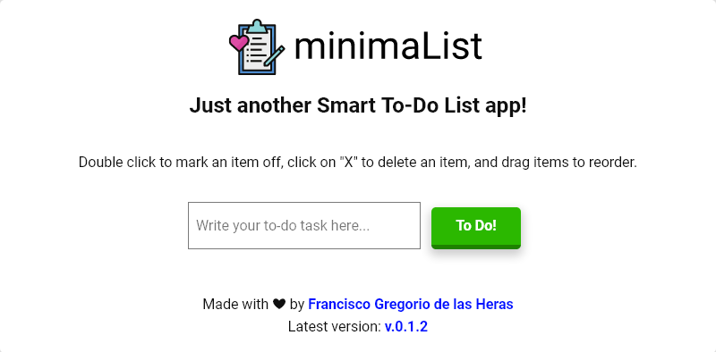

<!-- PROJECT LOGO -->
 

  
  

    Just another To-Do-List mini-app built with HTML, CSS and JavaScript / jQuery.
  

<!-- TABLE OF CONTENTS -->

  
Table of Contents

  <ol>
    <li><a href="#about-the-project">About The Project</a></li>
    <li><a href="#built-with">Built With</a></li>
    <li><a href="#license">License</a></li>
    <li><a href="#contact">Contact</a></li>
    <li><a href="#acknowledgements">Acknowledgements</a></li>
  </ol>

<!-- ABOUT THE PROJECT -->
## About The Project

  

Objective:
- Build a mini web application with HTML, CSS and JavaScript that allows the user to write and edit a to-do list.

User Stories:
- As a user, I want to write to-do tasks in a list with a clean and minimalistic interface.
- As a user, I want to cross tasks off my list that have been done.
- As a user, I want to delete tasks from my list.
- As a user, I want to reorganize the tasks on my list.

Key Features: 
- Add an item to a list.
- Mark an item as done.
- Delete an item from the list.
- Change the order of items in the list.

## Built With

- [jQuery](https://jquery.com/)
- [Normalize.css](https://necolas.github.io/normalize.css/)
- [Visual Studio Code](https://code.visualstudio.com/)
- [Prettier](https://prettier.io/)
- [ESLint](https://eslint.org/)

## License

Distributed under the MIT License. See `LICENSE` for more information.

<!-- CONTACT -->
## Contact

Francisco Gregorio de las Heras - [@herasdev](https://twitter.com/herasdev)

Project Link: [https://gregoriodelasheras.github.io/minima-list/](https://gregoriodelasheras.github.io/minima-list/)
